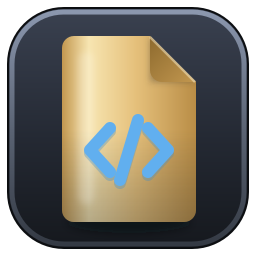

#  rudbgen

[](https://github.com/xcomart/rudbgen/actions/workflows/ci.yml)
[](LICENSE)


A multi-platform source-code generator written in Rust, built on
[gpui](https://gpui.rs) — the GPU-accelerated UI framework behind the Zed editor
— that reads the metadata of any database with a JDBC driver through an embedded
JVM bridge and renders it through templates. Tick tables, tick templates, get one
file per pair.

> **Status: pre-release.** rudbgen is a rewrite of
> [jdbgen](https://github.com/xcomart/jdbgen), and its template language is
> jdbgen's, engine and all — the same placeholders, conditions, loops and
> decorators, checked against jdbgen's own test suite and byte-identical output
> fixtures. Templates written for jdbgen render here unchanged. What has changed
> is everything around them. See [docs/status.md](docs/status.md) for how far
> the work has come.


<p align="center">
  
  
</p>

## What works today

Written against jdbgen, because that is what most of this is for:

- **One window, and nothing to get past.** jdbgen opened a login dialog, then a
  connection manager, then a generator window, each on top of the last. rudbgen
  opens on a welcome screen listing your saved connections; one click connects,
  and the explorer, the work area and the inspector are the same frame from then
  on. Nothing modal stands between you and the first click.
  
- **No master password.** jdbgen encrypted the URL, the user name and the
  password with a master password you had to type at every start. rudbgen puts
  the password — and an SSH key passphrase — in the operating system's own
  keychain, and stores nothing secret on disk. There is nothing to remember and
  nothing to lose.
- **A schema explorer with a checkbox on every row.** Catalog → schema → table,
  fetched lazily, with jdbgen's contains-filter over it and a views toggle. The
  ticked set survives filtering, collapsing and refreshing — it is only cleared
  by a new connection — and a schema's three-state box acts on the rows you can
  actually see.
- **A table inspector**: columns, the primary key **in key order**, foreign keys
  in *both* directions, and indexes. jdbgen had a Table View modal and neither
  foreign keys nor indexes at all.
- **Foreign keys and indexes in the model the templates see.** `imports`,
  `exports`, `indexes` on a table; `precision`, `scale`, `autoIncrement`,
  `keySeq` and a single-column `fk` on a column. All new, all additions — every
  field jdbgen had answers exactly as it did.
- **Preview before you write.** The status bar does the arithmetic — *n* tables ·
  *m* templates → *n*×*m* files — **Preview** renders one pair into a tab, and
  **Dry run** renders all of them without writing anything, listing every path,
  whether it replaces something, and how big it would be.
- **A cancellable run with a verdict.** Every template is parsed before any file
  is written, so a syntax error costs nothing and names the template, the half
  and the line. The run has a progress bar, a log and a Cancel that takes effect
  at the next file boundary; an existing file asks Overwrite / Skip / Overwrite
  all / Skip all / Cancel; and it ends in a summary of every file written,
  skipped and failed, with a button to open the output directory. Files are
  written atomically — a crash cannot truncate one.
  
- **Any JDBC driver.** Drivers are downloaded from Maven Central by coordinate
  or picked from disk, the driver class is detected from the JAR without running
  a static initialiser, and each connection gets its own isolated class loader.
- **jdbgen's four custom queries, with a Test button.** For a driver whose
  `DatabaseMetaData` is wrong or missing, supply your own SQL for the table list,
  the column list and the two comment queries. Test runs the statement on a live
  session and tells you *which required label is missing*, instead of letting you
  discover it halfway through a run.
  
- **SSH tunnels** with password or private-key auth, loopback binds only, and no
  PTY on the bastion — `nologin` jump hosts work.
- **Templates are documents, not file paths.** A template opens in a tab of its
  own: the editor with template-language highlighting layered over the output
  file's own language, a live preview that follows the *buffer* against a table
  you pick, gutter marks for parse errors and for **unknown fields** — jdbgen's
  way of finding a typo like `${nmae}` was to read the generated file — a
  clickable variable palette of every field the model offers, and completion on
  <kbd>Ctrl</kbd>+<kbd>Space</kbd>.
  
  
- **An abbreviation rules editor.** The four-column table jdbgen kept in its
  configuration window, with a trailing empty row, a table-name picker for
  whole-name rules, and a refusal to save two rules that would silently become
  one. Word rules now match **whatever the case**, which is the one deliberate
  behavioural break from jdbgen — where they only ever matched lower-case
  segments and so never fired on `TB_USR`.
  
- **A one-time import from jdbgen.** Point it at a `config.json`, type the
  master password once, and it reads both of jdbgen's encryption formats, shows
  what it found with a checkbox each, and writes your connections, drivers,
  template sets and abbreviation rules — passwords into the OS keychain. Your
  jdbgen configuration is opened read-only and left exactly as it was.
  
- **Themes and languages**: UI and editor theme registries with live preview,
  import/export and a user theme directory; eight interface languages (en, ko,
  ja, zh-CN, de, es, fr, ru), switched live.

## Installing

Download the build for your platform from
[Releases](https://github.com/xcomart/rudbgen/releases). **No JDK needed** —
every download carries a Java runtime built with `jlink`, and rudbgen uses the
one next to its executable.

- **Windows** — `…-setup.exe` installs into your user profile (no administrator
  rights, no UAC prompt) and is what `winget` uses; `….zip` is the same tree,
  portable. Either way SmartScreen may warn, because the signature is
  self-signed at best: **More info → Run anyway**.
- **macOS** — unpack the `.tar.gz` and drag `rudbgen.app` to Applications. The
  bundle is ad-hoc signed rather than notarized, so the first launch needs
  **right-click → Open**.
- **Linux** — unpack the `.tar.gz` and run `./install.sh`. It copies the tree to
  `~/.local/share/rudbgen`, links it from `~/.local/bin/rudbgen`, and installs
  the desktop entry and icons. No root; make sure `~/.local/bin` is on your
  `PATH`.

Each archive also carries a sample H2 database under `sample/`, so there is
something to connect to before there is anything to connect to.

Every platform's caveats, the data directory, the keychain and the updater are
in [docs/installation.md](docs/installation.md).

To use a JDK of your own instead of the bundled runtime, point
`RUDBGEN_JAVA_HOME` at it (Java 17 or newer).

## Building

Prerequisites: stable Rust, and a JDK (17+) for the bridge.

```sh
# The Java half first: the Rust build refuses to proceed without the bridge JAR.
cd bridge && ./gradlew build && cd ..

# Then the workspace.
cargo build --release
```

`cargo build` does not invoke Gradle — having a JVM start every time you fix a
line of Rust would be intolerable. `rudbgen-jdbc`'s build script only checks that
`bridge/build/libs/rudbgen-bridge.jar` exists and tells you what to run when it
does not.

A build from source has no bundled runtime, so it looks for a JVM on the system —
`RUDBGEN_JAVA_HOME`, then `JAVA_HOME`, then the usual locations. Only the release
archives ship a runtime of their own.

Running the tests mirrors CI: the bridge suite first, then the Rust workspace,
whose integration tests boot a real JVM against a real in-memory H2 (the driver
JAR comes from the Gradle cache, or from `RUDBGEN_TEST_H2_JAR`):

```sh
cd bridge && ./gradlew build && cd ..
cargo test --workspace
```

On Linux, gpui links against `libxkbcommon` (with its X11 half),
`wayland-client` and `fontconfig` development packages; see
[.github/workflows/ci.yml](.github/workflows/ci.yml) for the exact list.

Release archives are built by
[.github/workflows/release.yml](.github/workflows/release.yml) from a version
tag: Gradle, then `jlink`, then `cargo`, then packaging.

## Documentation

- [Installation](docs/installation.md) · [User interface
  guide](docs/ui-guide.md)
- [Template reference](docs/template-reference.md) — the language, its fields,
  and the three places the port deliberately differs from jdbgen
- [Custom queries](docs/custom-queries.md) — for a driver whose metadata is
  wrong

## Architecture

The design document — the decisions, the crate layout, the JNI bridge, the
template engine and its compatibility canary, the metadata model, the generation
job and the milestone plan — lives in
[docs/architecture.md](docs/architecture.md). Current progress and open items are
tracked in [docs/status.md](docs/status.md).

gpui comes from a pinned revision of Zed's monorepo rather than from crates.io,
whose newest release (0.2.2) predates the split of the crate into a
platform-independent core, a `gpui_platform` facade and per-OS backends. Four of
those crates — `gpui`, `gpui_linux`, `gpui_macos`, `gpui_windows` — are vendored
under `vendor/` and patched back over the git source, each change marked
`RULOGMAN PATCH`: the live title-bar switch, and three X11 fixes upstream has no
answer for. The trees are kept byte-identical with the same four in
[rulogman](https://github.com/xcomart/rulogman) and
[rudbman](https://github.com/xcomart/rudbman), so a fix moves between the three
projects as a plain diff.

## License

[MIT](LICENSE). The vendored gpui crates keep their upstream licenses.
