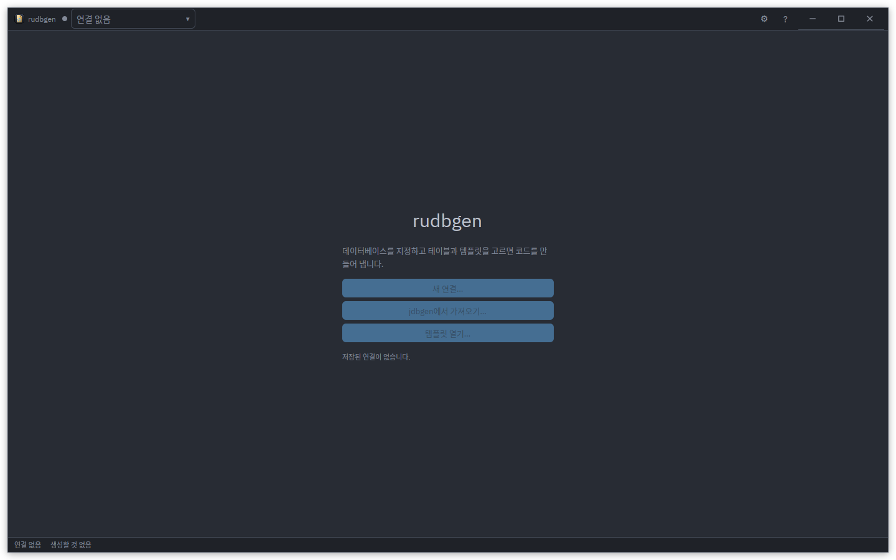
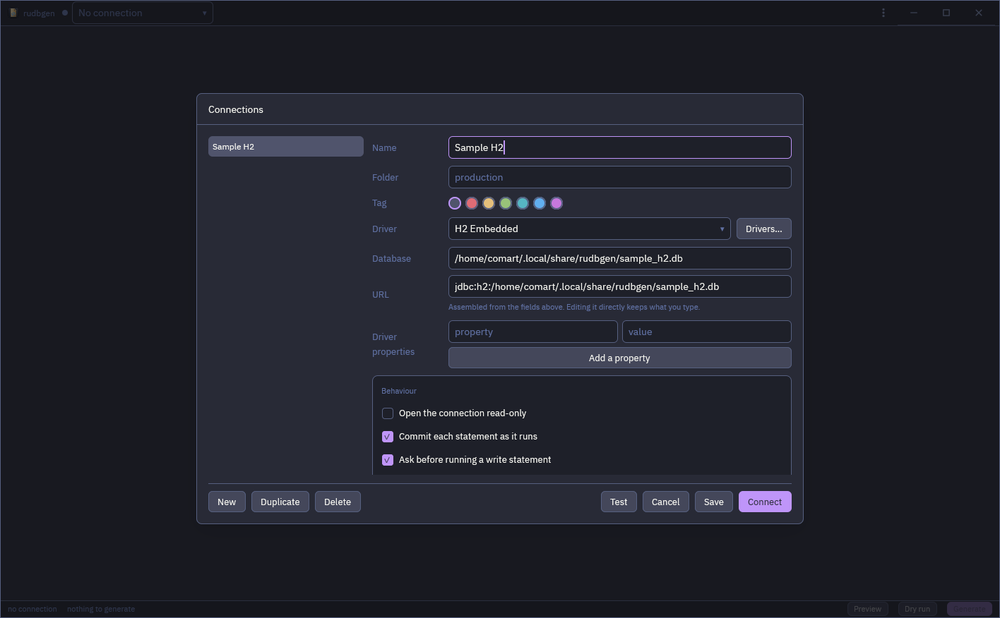
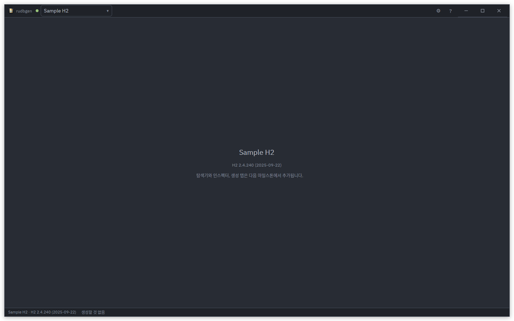
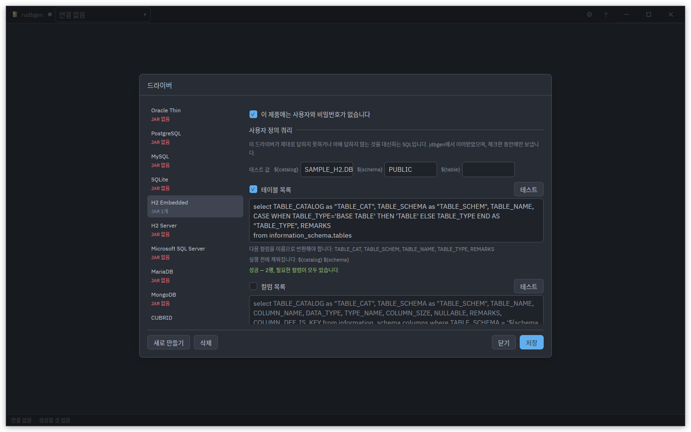
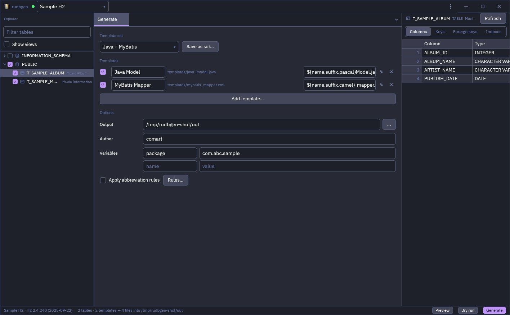
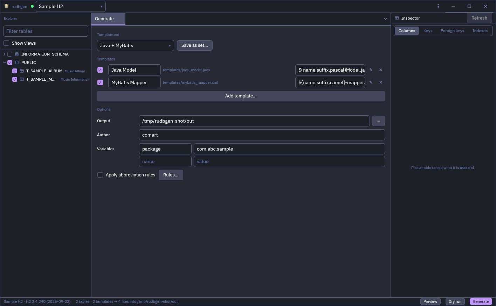
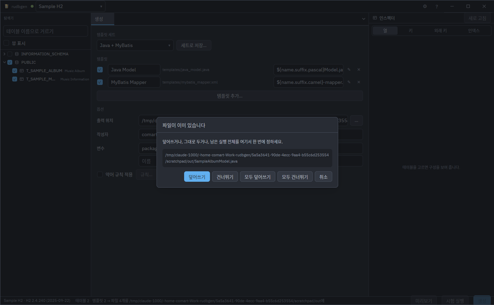
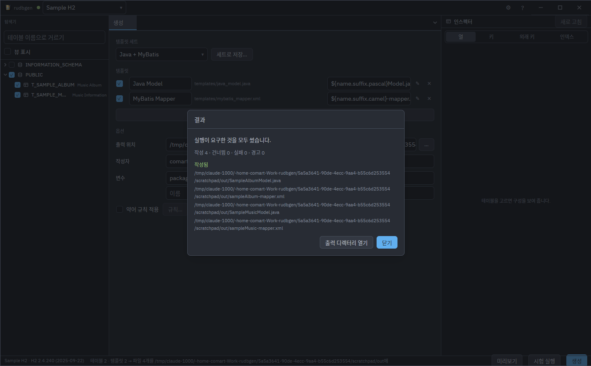

# User interface guide

rudbgen is **one window**. There is no modal gate to get through before you can
see anything, no separate generator dialog and no master password: the window
opens on a welcome screen, and everything else happens inside the same frame.

This guide describes the interface as it is in the current release. A few
surfaces the [architecture document](architecture.md) §4 describes are not built
yet; each of those is marked **Next release** where it belongs, so the shape of
what is coming is visible from here.

[← Documentation index](README.md)

- [The welcome screen](#the-welcome-screen)
- [Connecting](#connecting)
- [The driver editor](#the-driver-editor)
- [The window](#the-window)
- [The explorer](#the-explorer)
- [The inspector](#the-inspector)
- [The Generate tab](#the-generate-tab)
- [Preview and dry run](#preview-and-dry-run)
- [Running the generation](#running-the-generation)
- [Settings](#settings)
- [Keyboard shortcuts](#keyboard-shortcuts)

## The welcome screen



With nothing connected, the work area is the welcome screen: your saved
connections as a list — icon, name, driver, when it was last used — and a **New
connection** button. Clicking a row connects. The explorer and the inspector
stay out of the frame until a connection opens, so there is nothing on screen
that has nothing to say.

**Next release.** *Import from jdbgen…* appears here when a jdbgen
`config.json` is found in its own configuration directory; it asks for the
master password once, shows what it found — connections, drivers, template sets,
abbreviation rules — with a checkbox each, and then writes the stores and the
keychain. *Open a template* will also live here, for editing a template with no
database at all.

## Connecting



**New connection** (or <kbd>Ctrl</kbd>/<kbd>Cmd</kbd>+<kbd>N</kbd>) opens the
connection dialog: a name, a driver, the URL, credentials, extra properties, a
keep-alive probe and an SSH tunnel.

- **The driver** picks the URL shape. Choosing one fills the URL with its
  template — `jdbc:postgresql://{host}:{port}/{database}` — and the fields under
  it fill the holes; the URL stays editable, so an option the form has no field
  for is typed straight into it. A driver marked as needing no authentication (a
  file-backed H2 or SQLite) hides the credential fields instead of asking a
  question with no answer.
- **The password** goes to the OS keychain, never to `connections.json`. See
  [Installation](installation.md#passwords-and-the-os-keychain).
- **Test** opens the connection, reports what came back, and closes it again.
- **SSH tunnel** takes a bastion host, a password or a private key, and binds
  only on loopback. It does not ask for a PTY, so a `nologin` jump host works.
- **Save** is the only thing that writes. Every field is a draft until then —
  cancel and nothing changed, including the keychain.

The title bar carries the connection selector: the open connection with a status
dot (connecting, connected, failed), every saved connection under it, and a
**Disconnect** row. Switching connections swaps the explorer and the Generate
tab's options, because those belong to the connection.



A connection that fails says so on the status bar and in a banner over the work
area — never in a box you have to dismiss before you can read the URL that was
wrong.

## The driver editor



**Edit** beside the driver picker replaces the connection dialog's body with the
driver editor — one tab ring, never a dialog inside a dialog. It holds the
driver's class, its JARs, its URL template, its default port and the properties
handed to every connection that uses it.

- **JARs** come from Maven Central by coordinate (`group:artifact:version`, with
  a progress bar and a Cancel) or from disk.
- **The driver class is detected** from the JARs rather than typed: rudbgen asks
  the bridge which `java.sql.Driver` implementations they hold, without running
  a single static initialiser. Picking a sources or javadoc JAR by mistake says
  so in those words.
- **Custom queries** is the section at the bottom: four rows — table list,
  column list, table comments, column comments — each a tick, a SQL field, the
  contract it has to satisfy, and a **Test** button. One shared row of test
  values above them supplies `${catalog}`, `${schema}` and `${table}`.

  This is jdbgen's four SQL overrides, for products whose driver reports its
  metadata badly or not at all. [Custom queries](custom-queries.md) is the
  reference; the short version is that Test runs the statement on a session
  using this driver and tells you which required label is missing, rather than
  letting you find out in the middle of a generation run.

## The window

Once connected the window is three columns over a status bar:

```
┌ [⌂ rudbgen]  [● Sample H2 ▾]                      [⚙] [?]  ─ □ ✕ ┐
├──────────────┬─────────────────────────────────┬─────────────────┤
│ EXPLORER     │ WORK AREA (tabs)                │ INSPECTOR       │
│ 🔍 filter    │ ┌ Generate ┐┌ Preview ┐         │ T_SAMPLE_ALBUM  │
│ ☐ views      │ │                                │ Columns│Keys│FK│
│ ▾ PUBLIC     │ │  Template set  [Java + MyBatis▾]│ # name  type  K │
│   ☑ T_ALBUM  │ │  ☑ Java Model  ${…}Model.java  │ 1 ALBUM_ID INT ● │
│   ☑ T_ARTIST │ │  ☑ Mapper XML  ${…}-mapper.xml │ 2 NAME  VARCHAR  │
│   ☐ T_TRACK  │ │  ☐ PHP CI      …               │ …               │
│ ▸ INFO_SCHEMA│ │  Output   ~/out/src      [...]  │                 │
│              │ │  Author   comart                │                 │
│              │ │  Variables  package=com.abc.x   │                 │
├──────────────┴─────────────────────────────────┴─────────────────┤
│ 2 tables · 2 templates → 4 files into ~/out/src  [Preview][Dry run][Generate ▶]│
└──────────────────────────────────────────────────────────────────┘
```

Both side panels have a draggable divider and remember their width; both toggle
with a shortcut (<kbd>Ctrl</kbd>+<kbd>B</kbd>, <kbd>Ctrl</kbd>+<kbd>I</kbd>) and
both disappear when nothing is connected.

The rule the layout follows: **selection lives in the explorer, options live in
the work area, the verdict lives in the status bar.** The three never overlap.

## The explorer



Catalog → schema → table, fetched lazily: a schema's tables are read the first
time you expand it and cached after that.

- **The filter box** is a contains match, case-insensitive — jdbgen's rule.
- **The views toggle** shows or hides views. Both forms are fetched either way,
  so flipping it costs no round trip.
- **A checkbox on every row.** The ticked set is what will be generated. It
  survives filtering, the views toggle, collapsing a node and a refresh; only a
  new connection clears it. A schema's own box is three-state and acts on the
  rows **currently on screen**, so it composes with the filter instead of
  fighting it.
- **Right-click** offers *select all shown*, *clear*, *invert*, *open in
  inspector* and *refresh*.

Ticking a row is never the same gesture as selecting it: the checkbox swallows
its own press.

## The inspector

The panel on the right shows the table under the cursor — fetched in the
background, cached per table, so walking the tree costs one round trip each.
Four tabs:

| Tab | What it shows |
|:---|:---|
| Columns | Ordinal, name, type, nullability, default, `PK`*n* and comment |
| Keys | The primary key, **in key order** rather than column order |
| Foreign keys | Both directions — what this table points at, and what points at it |
| Indexes | Name, uniqueness, columns in index order |

This is the same model the templates see, so it doubles as a way to check what a
template will get. Foreign keys and indexes are new in rudbgen; jdbgen showed
neither.

**Next release.** With a template tab active, the inspector becomes the
**variable palette** instead: every field the current model offers, clickable to
insert `${…}` at the caret.

## The Generate tab



The Generate tab is permanent and is the **only** place a connection's
generation profile is edited. Everything on it is saved to that connection as
you change it — debounced, and only when it actually differs from what was last
written.

- **Template set** — the saved sets, plus `Custom` as soon as the list matches
  none of them. Two sets ship: *Java + MyBatis* and *PHP CodeIgniter*.
  **Save as set…** stores the current list under a name.
- **The template list** — one row per template: a tick, its name, its file, the
  **output name template** that names the file it writes, and buttons to edit or
  remove it. *Add template…* opens a file picker starting in your templates
  directory.

  The output name is itself a template: `${name.suffix.pascal}Model.java`, or
  `${package.replace('.','/')}/${name.suffix.pascal}.java` to write into a
  package tree — the directories are created for you. An absolute path, or one
  that climbs out of the output directory with `..`, is refused.
- **Output directory**, with a chooser.
- **Author** — what `${author}` renders as.
- **Custom variables** — a key/value table with a trailing empty row that
  becomes a real row as soon as you type in it.
- **Apply abbreviations** — the switch that inserts `.abbr` into every `${name}`
  reference automatically. The **Rules…** button beside it is disabled until the
  next release; the rules themselves are already read from
  `abbreviations.json` and applied.

**Next release.** The **Edit** glyph on a template row will open the template in
a tab of its own: the editor with template highlighting, a live preview beside
it, gutter marks for parse errors and unknown fields, and
<kbd>Ctrl</kbd>+<kbd>S</kbd> to write. Today the templates are text files you can
edit in any editor — see [Template reference](template-reference.md) — and
rudbgen re-reads them on every run.

## Preview and dry run

Both live on the status bar, beside the arithmetic of the run: *n* tables · *m*
templates → *n*×*m* files into the output directory.

- **Preview** opens a Preview tab and renders **one** pair — pick the table and
  the template from the two dropdowns in its header.
- **Dry run** renders **all** of them without writing anything, and lists what
  would happen: every path, whether it replaces an existing file, and how big it
  would be. Selecting a row shows the text underneath.

A dry run is the cheap way to find out that an output name template collides, or
that a template fails on one particular table.

## Running the generation

**Generate ▶** (<kbd>Ctrl</kbd>+<kbd>G</kbd>) is disabled with a reason in its
tooltip — *no connection*, *no tables ticked*, *no templates ticked*, *no output
directory* — rather than an error box after the click. The first missing thing is
the one it names.

Every template is parsed **before** any file is written, so a template with a
syntax error costs you nothing: the run stops, names the template, which half of
it (body or output name) and the line.



While it runs, a progress dialog shows a bar, a log and **Cancel** — cancellation
takes effect at the next file boundary, so a half-written file is never left
behind. When a file already exists, the default policy asks, with **Overwrite**,
**Skip**, **Overwrite all**, **Skip all** and **Cancel**. The default policy
itself is a setting (`ask`, `overwrite` or `skip`).



At the end comes the result summary: every file written, skipped and failed —
with the failing template's line for each failure — the count of unknown-field
warnings, and **Open output directory**.

Files are written atomically, so a crash cannot leave a truncated source file in
your tree.

## Settings

<kbd>Ctrl</kbd>+<kbd>,</kbd> opens Settings: the UI theme and the editor theme
(both with live preview, both importable from a file and extensible from a user
theme directory), the interface language, the fonts, the Java heap the embedded
JVM starts with, the window chrome, and the default overwrite policy. The
language changes live — there is nothing to restart.

Eight languages ship: English, Korean, Japanese, Simplified Chinese, German,
Spanish, French and Russian.

## Keyboard shortcuts

On macOS, read <kbd>Cmd</kbd> for <kbd>Ctrl</kbd>.

| Shortcut | Action |
|:---|:---|
| <kbd>Ctrl</kbd>+<kbd>N</kbd> | New connection |
| <kbd>Ctrl</kbd>+<kbd>G</kbd> | Generate |
| <kbd>Ctrl</kbd>+<kbd>B</kbd> | Show/hide the explorer |
| <kbd>Ctrl</kbd>+<kbd>I</kbd> | Show/hide the inspector |
| <kbd>Ctrl</kbd>+<kbd>,</kbd> | Settings |
| <kbd>Esc</kbd> | Dismiss the dialog on top |
| <kbd>Ctrl</kbd>+<kbd>Q</kbd> | Quit |

Preview and Dry run are deliberately unbound: they are one button press away,
and the chords are better spent on the template editor.

---

## Related documentation

- [Template reference](template-reference.md) — the language of the files the
  template list points at.
- [Custom queries](custom-queries.md) — the driver editor's four SQL overrides.
- [Installation](installation.md) — where the settings and templates are kept.
